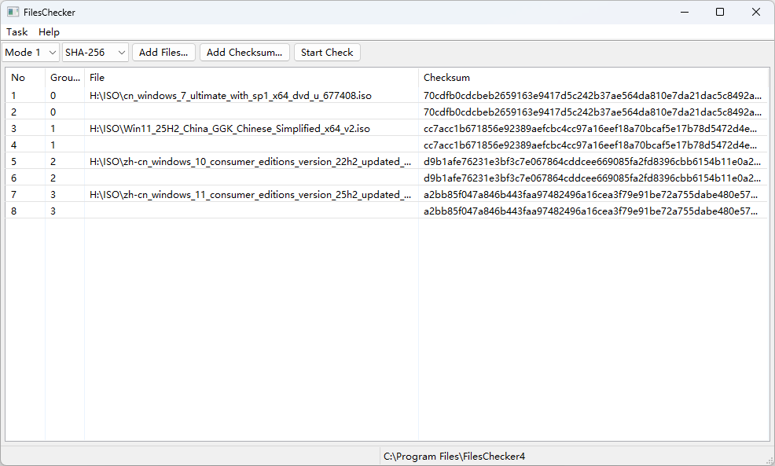
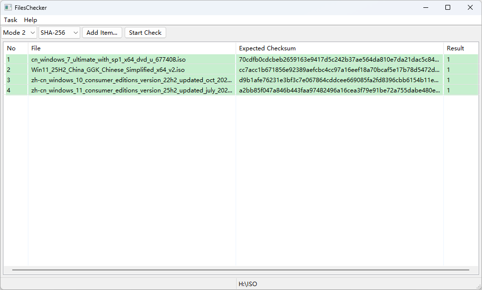
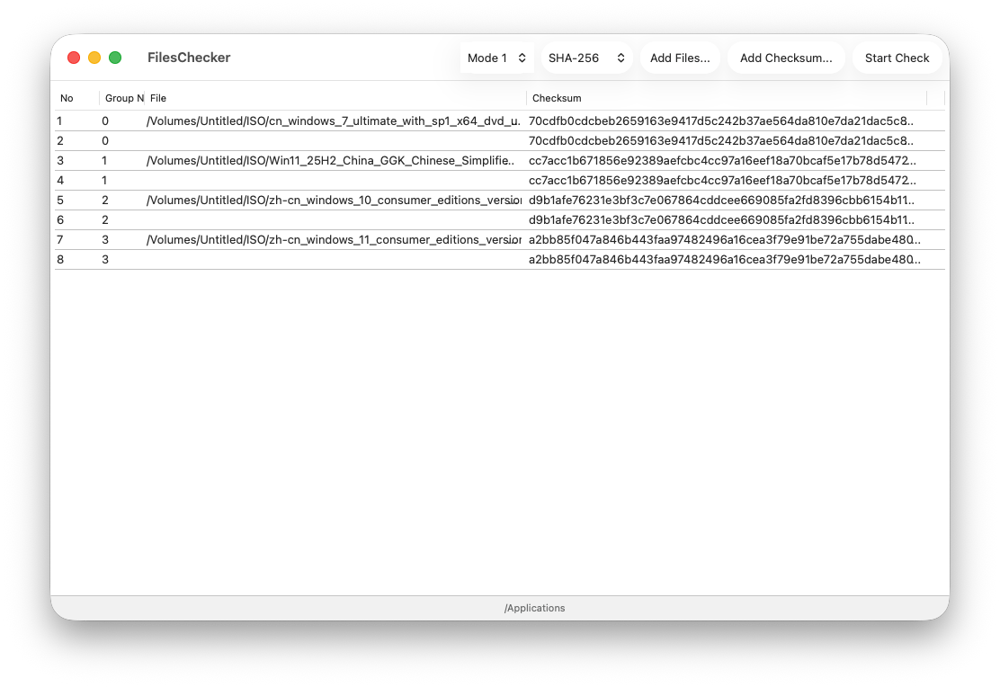
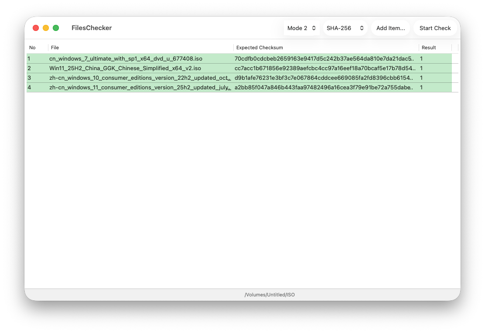

# FilesChecker

    
    
    
    

[简体中文](README_Chinese_Simplified.md)  [繁體中文](README_Chinese_Traditional.md)

FilesChecker is a simple and easy-to-use batch file validation tool that supports algorithms such as MD5, SHA-1, SHA-256, SHA3 series, CRC-32, etc.

## Downloads

    
    
    

We currently only provide installation programs for: 
- Windows x64 (Windows 10 (10.0.10240.16384) and later) 
- Windows Arm64 (Only tested on Windows 11 25H2)
- macOS (Apple Silicon Only, only tested on macOS 26 Tahoe) 

Other platforms can try downloading the source code and using it.

## Software Languages

At present, English, Simplified Chinese, and Traditional Chinese are available. Developers from all over the world are welcome to provide more language translations for this software. The development document can be found [here](https://github.com/ZHJ00000/FilesChecker/wiki/Language%20(Develop)).

