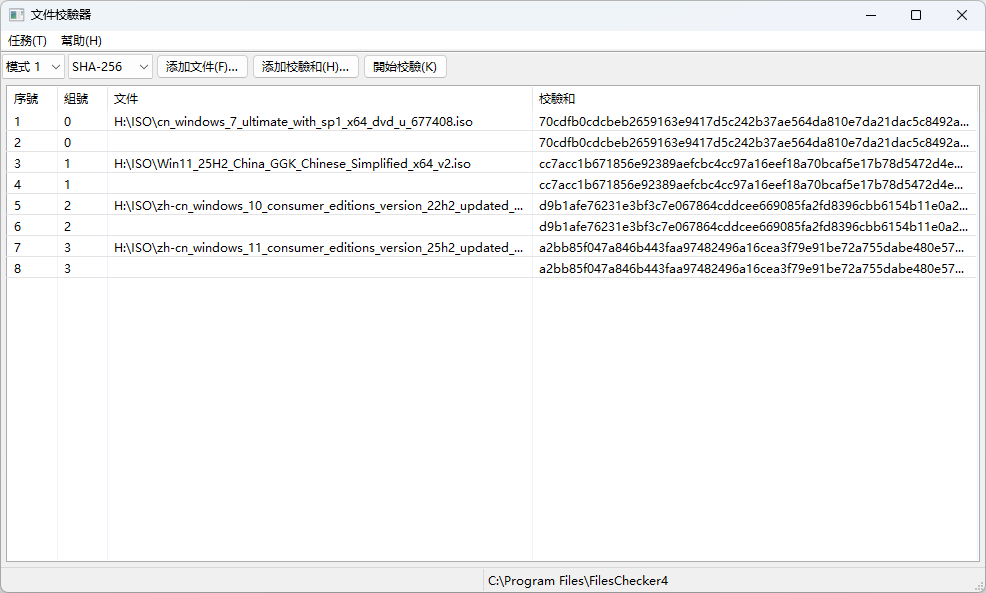
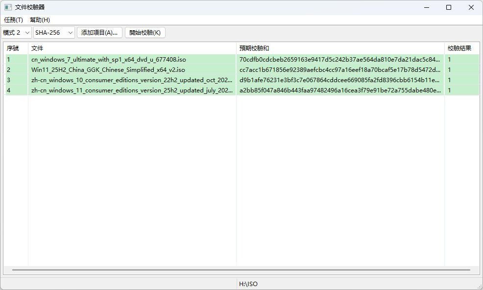
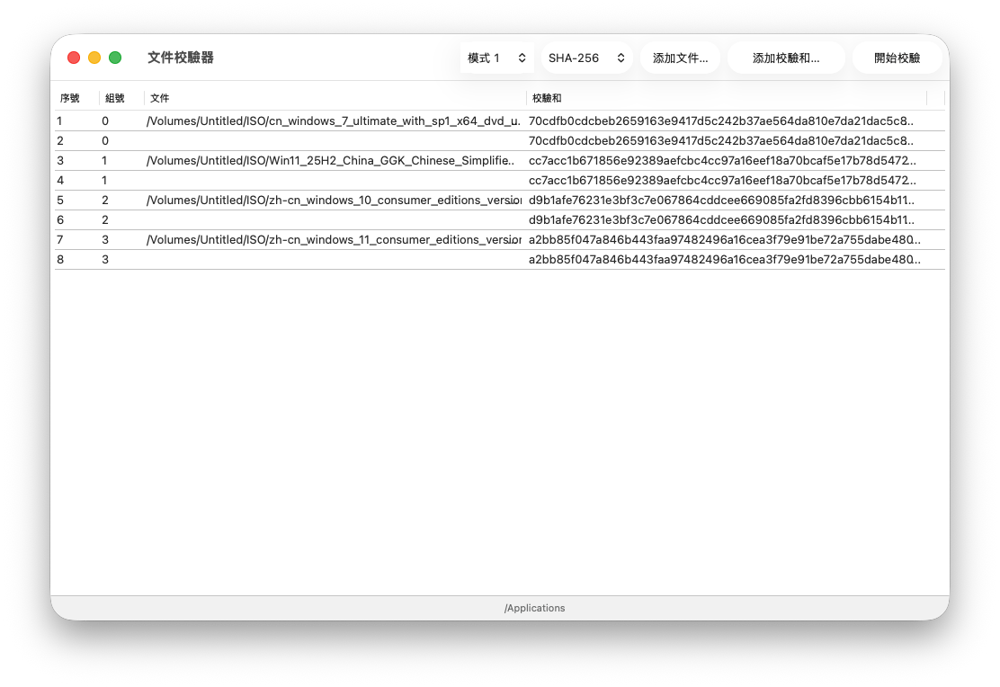
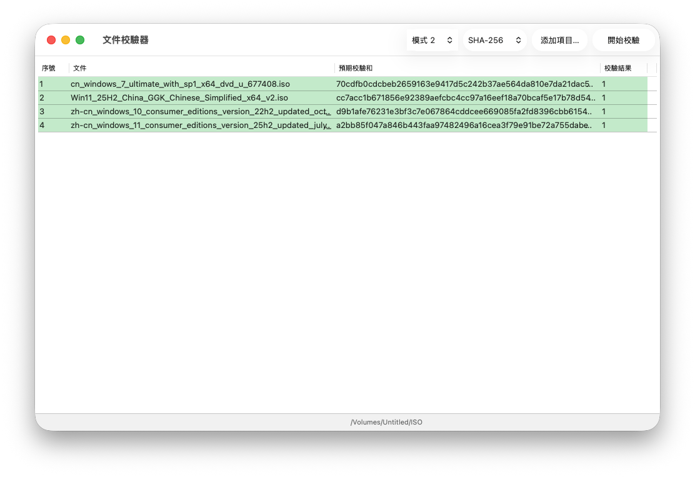

# 文件校驗器

    
    
    
    

[English](README.md)  [简体中文](README_Chinese_Simplified.md)

文件校驗器是一款簡單易用的批量檔校驗工具，支持MD5、SHA-1、SHA-256、SHA3系列、CRC-32等算灋。

## 下載

    
    
    

現時我們為以下作業系統提供安裝程式：
- Windows x64（Windows 10（10.0.10240.16384）及以上版本）
- Windows Arm64（僅在Windows 11 25H2上測試過）
- macOS（僅Apple晶片，僅在macOS 26 Tahoe上測試過）

其他平臺可嘗試下載原始程式碼並使用。

## 軟體語言

現時提供英語、簡體中文和繁體中文，歡迎來自全球各地的開發者為本軟件提供更多語言的翻譯，開發檔案在[此處 (僅英語)](https://github.com/ZHJ00000/FilesChecker/wiki/Language%20(Develop))。
